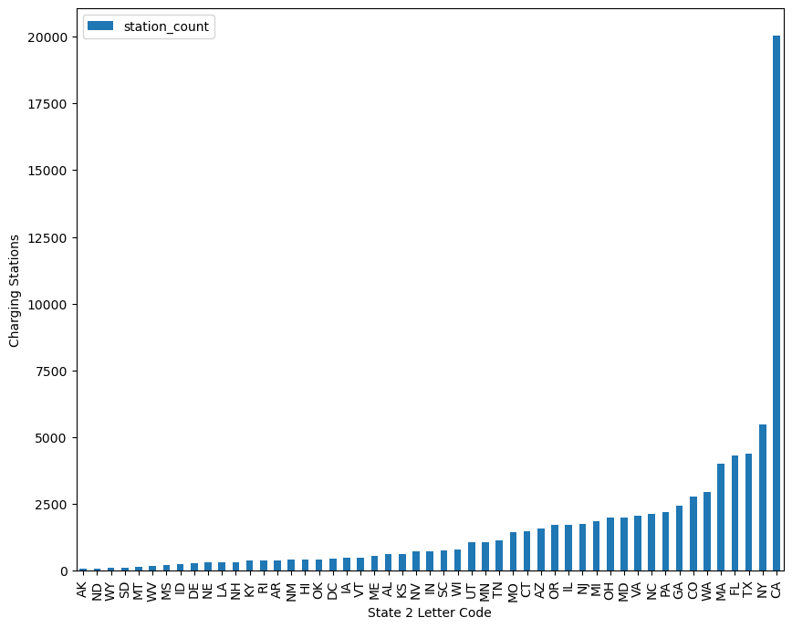
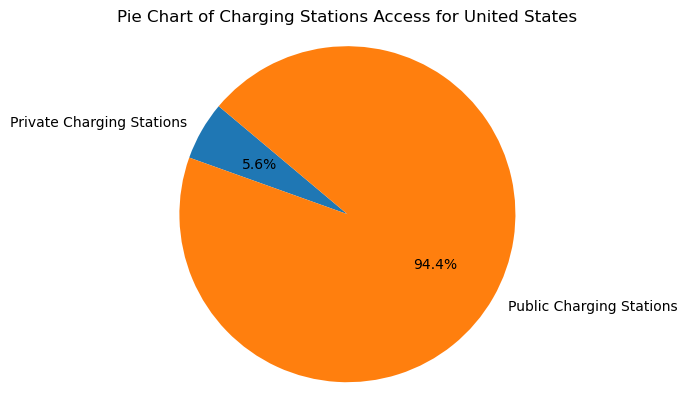
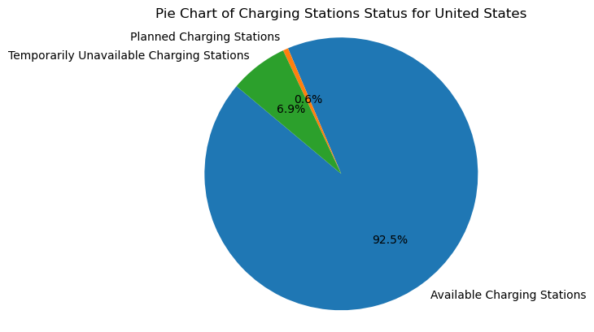

# Project 3 - Electric Vehicles and Charging Stations

## Minnesota Map by County of Electric Vehicles (EV) and Charging Stations (Stations)
### General Instructions
1. Open up site.html for the interactive leaflet map showing the registered EVs and Stations.
2. Hovering over each county provides the county name and number of registered EVs.
3. A check box is available to see the stations layered on top of the Registered EVs by County.
3. Clicking on any station provides the following information: station name and address, type and number of chargers.
### Code Source
- Jupyter code (MN_evreg2.ipynb) within MN_map folder
- site.html (interactive leaflet map) 
- logic1.js (web development project setup serves as the backbone of the JavaScript codebase) within static/js folder
### Dependencies, Data Input, and Data Clean Up
#### MN EV Registrations
- Accessed MN Public Utilities Commission website for EV registration data (https://mn.gov/puc/activities/economic-analysis/electric-vehicles/).
- Saved download as "2023_EV_Registration_Data.xlsx" in Resources folder.
#### MN County Mapping Information
- Accessed public.opendatasoft.com to obtain geoJson file of MN county boundary information for base map: (https://public.opendatasoft.com/explore/dataset/georef-united-states-of-america-county/export/?flg=en-us&disjunctive.ste_code&disjunctive.ste_name&disjunctive.coty_code&disjunctive.coty_name&refine.ste_name=Minnesota).
- Saved data as "georef-united-states-of-america-county.geojson" in Resources folder.
- Registration counts were included in geojson as "density" to drive the color gradient and saved as "data.js" in the "static/js" folder.
#### MN Charging Station Information
- Charging Stations snapshot as of April 1, 2025 for all electric charging stations in Minnesota provided by the National Renewable Energy Laboratory (https://afdc.energy.gov/data_download).
- Saved to "minnesota_stations.geojson" in "static/js" folder.

## United States Map by State of Electric Vehicles (EV) and Charging Stations (Stations)
Open up the index.html for the interactive leaflet map showing the registered EVs and Stations.  
A check box is available to see the stations layered on top of the Registered EVs by State.  
- The State Station will provide you information on how many charging stations there are per state.  
- The Access Station will provide you information on how many private or public charging stations there are per state.  
- The Status Station will provide you information on how many available, planned, temporarily unavailable charging stations there are per state.  

#### Code Source
Jupyter code (evRegistration.ipynb) within US_EV.  
PostgreSQL (schema.sql) within US_EV.  
index.html (interactive leaflet map) within US_EV.  
logic.js (web development project setup serves as the backbone of the JavaScript codebase) within US_EV/js.
### Dependencies, Data Input, and Data Clean Up
Imported all dependencies and read in data CSV files.  
Datasets:  
1.  US Dept of Energy for registered EVs per state (https://afdc.energy.gov/vehicle-registration?year=2023)
2. Charging Stations (stations) snapshot of April 11, 2025 for all electric charging stations in the United States and Puerto Rico provided by the National Renewable Energy Laboratory (https://afdc.energy.gov/data_download). Data was downloaded as a csv file. The input file exceeds GitHub free version upload limit and it was not uploaded to the repository, however, schema.sql outputs summarize snapshot.  
- Used schema.sql (pg4Admin) to clean up stations snapshot and generate summation by state, access, status, and stations (count). Ouput files generated are state_stations.csv, access_stations.csv, and status_stations.csv which are saved in the US_EV/Ouput folder.  
3. Used State_Coordinates.csv to find the coordinates for each state, file can be found in the US_EV/Output folder.  
4. Used data1.js generated by evRegistration.ipynb for state_stations, access_stations, and status_stations arrays for more information go to Charging Stations section.
### Electric Vehicles (EV)
 1. Web scraped the data from the US Dept. of Energy to put into a dataframe then combined it with US States geojson (https://leafletjs.com/examples/choropleth/) for the state borders to highlight/color each state based on the number of registered EVs(density). Uploaded it to the data1.js file.
 2. Added color gradients for registered EVs per state to the Leaflet map in logic.js that includes a legend and a hover over feature to show the exact number of registered EVs for the selected state (code source- https://leafletjs.com/examples/choropleth/).
#### Analysis
By looking at the registered EVs per state:  
- We found California has the most registered EVs with 1,256,600, which is about a million more than the next highest state, Florida which has 254,900.  
- MN is 21 on the list for registered EVs.  
- ND is the lowest with 1000 registered EVs.

### Charging Stations (Stations):
#### Processing
1. Created a schema.sql to read snapshot input csv file. Within schema.sql cleaned and transformed the data to provide:  
- state_stations.csv output file of United States (US) not including Puerto Rico data by how many charging stations by state.  
- access_stations.csv output file of US not including Puerto Rico data by private and public access by state.  
- status_stations.csv output file of US not including Puerto Rico data by E (Available), P (Planned), T (Temporarily Unavailable) status by state.  
2. Used schema output files and tranformed the data using evRegistration.ipynb to add:  
- state coordinates for markers creation in logic.js.  
- created pivot table that summarizes the station_count for each access_code and status_code and reset the index.  
- added analysis for each ouput file see section Analysis for results.  
- converted dataframes to JavaScript arrays format.  
- prepared the JavaScript content.  
- wrote the data1.js.  
3. Added leaflet overlayMaps to logic.js for State, Access, and Status Stations (Markers).
#### Analysis:
By looking at a snapshot of charging stations as of April 11, 2025 provided by evRegistration.ipynb: 
- We found California has the most stations with 20,038 and Alaska has the lowest stations with 74.  

- US has 94.4% public charging stations.  

- US has 92.5% available charging stations in snapshot.

## Charts Features
### Project and Purpose
 - The Charts feature uses a library not covered in class, Charts.js.
 - Two charts are populated using the MN Charging station json data, Count of EV Connector Types in MN and Count of EV Network Types in MN.
 - These charts provide valuable insight to the EV charging stations in MN.
### Using and Interacting with the charts
 - To view the charts, open the repo with VisualStudio and right-click on chartsIndex.HTML, then select Open in live Server.
 - A webpage will launch and the charts will automatically render with the data from the json file.
### Ethical Considerations
 - This data is publicly available from the website https://afdc.energy.gov/ and is used in a manner consistent with the terms and conditions stated on their page.
 - While the data includes publicly available phone numbers for EV charging stations, the dataset does not contain personally identifiable information for employees at that station.
 - Privately-owned EV charging stations (such as in a homeowner’s garage) are not included in this dataset.
## References
 - This data is publicly available on the website https://afdc.energy.gov/.
 - US Department of Energy. “EERE: Alternative Fuels Data Center Home Page.” Energy.gov, 	2019, afdc.energy.gov/.
 - The code used to render the charts was developed, in part, from the chartjs.org website https://www.chartjs.org/docs/latest/getting-started/.
 - “Step-By-Step Guide | Chart.js.” Www.chartjs.org, chartsjs.org, 15 Apr. 2025, www.chartjs.org/docs/latest/getting-started/usage.html. Accessed 16 Apr. 2025.
 - Additional features from the chart.js library were combined to display the json data to improve the user experience.
- Datasets stated in subcategories.  
- Guidance on overlaymaps, jupyter notebook tabular table, and JavaScript coding was sourced from theXpert Learning Assistant Chat+, an AI Learning tool for Edx.  
- Used google for leaftlet maps and marker functions accessed April 2025. 
